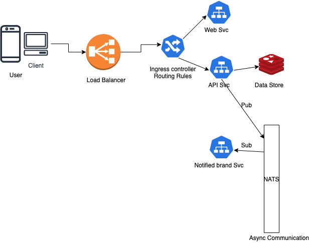

# discount-code-design

## a. choices before the design (around 20 mins)
while I am scanning the assignment, bunch of questions jump to my head, e.g.
1. How many times a discount code can be used? only once or can be reused?
2. Follow the previous question, the validation time for the discount code. 
   1. for one time code, invalidate it after the using, do we consider activate it after cancel an order
   2. for multiple times code, how many times can it be used?
   3. what an expiration date for the code
3. how to generate the code? the length of the code? (technical design)
4. how much discount is applied? e.g. 90% or 70%, and the correlation between the discount number and the code
   1. does the discount code can only be exclusive apply?
5. the relationship between the code and the brand
6. generated time and activated time of the code

## b. overview

## c. break down the service to concrete pieces
### how to generate the code
take consideration of scalability, we may need generate a UUID

To simplify, suppose I already have a `brand` object, a `user` object which contain the user's contact information.

### The aspects

● APIs – anything HTTP based
- so we need a `/generate_codes` API
   which accept `brand_id` and `codes_number` as parameter, response the `status` of code generation.
- secondly, a `/get_code` API, which accept a Authentication token in the header, and return a `code` as response.
   in the programming side, we may create a relation between the code and user who request it. In this turn, we may use `Hash` data type which code as field,and user_id as value
- thirdly, a `/activate_code` API, also need a user token for validation, and `code` as parameter, response provide information of the activation process.
   
   e.g. `status`=>['success', 'expired']

● Data stores

For Data stores, intuitively, I think can use Redis `Sets` as Data Store, as it is possible to add, remove, and test for existence of members in O(1)

● Data validation – how and for what data

For data validation, 1) it is important to validate does the `code` is correct or expire (has been used for one time code), 2) further we may also validate does it was used by a right people.
3) log ip addresses for later auditing

● Async communication
> As a brand I want to be notified about a user getting a discount code so that I can process information about the user for my loyalty programme.

think of a messaging system, an event happened, dispatch this event to a watcher (Pub/Sub pattern)

● Authentication

On end user part, I'm going to adapt OAuth workflow, 
